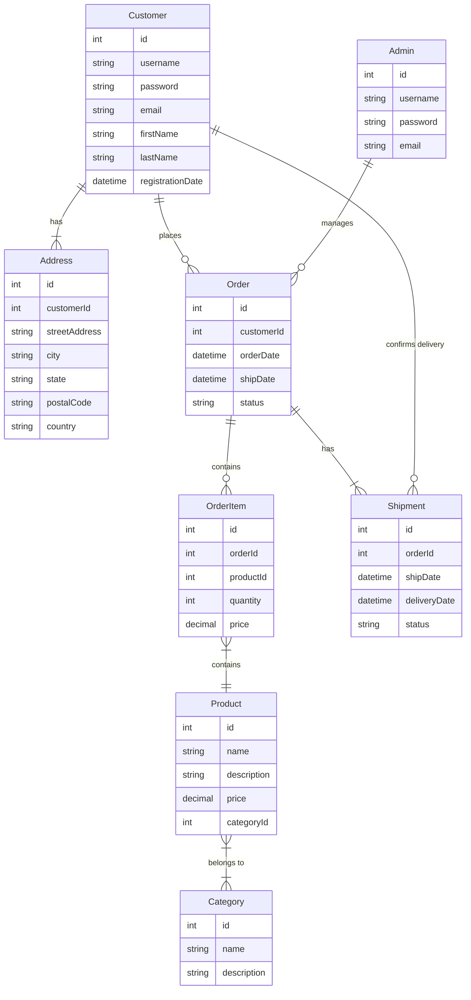

# Product Catalog Software

This is a web-based software for managing a product catalog, allowing customers to place orders and track shipment statuses.

## Features

- Customer login and registration
- Customer can add multiple addresses
- Admin login
- Admin can add products and manage categories
- Customer can make an order with one or more products, each with a specific quantity
- Order may or may not be shipped
- Admin can manage orders and shipment statuses
- Customer can confirm the shipment has been delivered

## Technologies Used

- Java
- Spring Framework
- Angular
- PostgreSQL

## Installation

1. Clone the repository:

   ```bash
   git clone https://github.com/muhammad-saad-01/product-catalog.git
   ```

2. Set up the database:

    - Create a new PostgreSQL database with the name `product_catalog`.
    - Set the database credentials in the `application.properties` file in the `backend/src/main/resources` directory.

3. Start the backend server:

    - Navigate to the `backend` directory.
    - Run the following command:

      ```bash
      ./mvnw spring-boot:run
      ```

4. Start the frontend server:

    - Navigate to the `frontend` directory.
    - Run the following command:

      ```bash
      ng serve
      ```

    - The frontend server should be running at `http://localhost:4200`.

## ERD Diagram

Here's the ERD diagram for the product catalog software, generated using a Mermaid script:



## Data Class Diagram

Here's the data class diagram for the product catalog software:

```
classDiagram
    class Customer {
        id: int
        name: string
        email: string
        password: string
        addresses: List<Address>
        orders: List<Order>
    }
    class Address {
        id: int
        customer: Customer
        street: string
        city: string
        state: string
        zip: string
    }
    class Category {
        id: int
        name: string
        products: List<Product>
    }
    class Product {
        id: int
        category: Category
        name: string
        description: string
        price: decimal
        imageUrl: string
        orderItems: List<OrderItem>
    }
    class Order {
        id: int
        customer: Customer
        date: datetime
        status: string
        shippingDate: datetime
        deliveryDate: datetime
        orderItems: List<OrderItem>
        shipment: Shipment
    }
    class OrderItem {
        id: int
        order: Order
        product: Product
        quantity: int
    }
    class Shipment {
        id: int
        order: Order
        trackingNumber: string
        date: datetime
        status: string
    }

```
