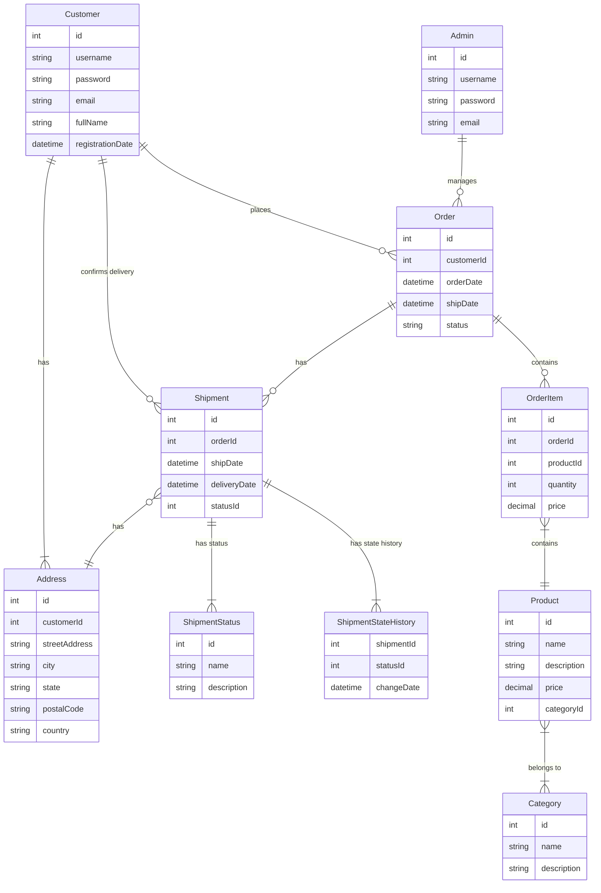

# Product Catalog Software

This is a web-based software for managing a product catalog, allowing customers to place orders and track shipment statuses.

## Features

- Customer login and registration
- Customer can add multiple addresses
- Admin login
- Admin can add products and manage categories
- Customer can make an order with one or more products, each with a specific quantity
- Order may or may not be shipped
- Admin can manage orders and shipment statuses
- Customer can confirm the shipment has been delivered

## Technologies Used

- Java
- Spring Framework
- Angular
- PostgreSQL

## Installation

1. Clone the repository:

   ```bash
   git clone https://github.com/muhammad-saad-01/product-catalog.git
   ```

2. Set up the database:

   - Create a new PostgreSQL database with the name `product_catalog`.
   - Set the database credentials in the `application.yaml` file in the `backend/src/main/resources` directory.

3. Start the backend server:

   - Navigate to the `product_catalog` directory.
   - Run the following command:

     ```bash
     ./mvnw spring-boot:run
     ```

4. Start the frontend server:

   > Disclaimer: Not Implemented Yet!
   - Navigate to the `Frontend` repository.
      1. Clone the repository:
          ```bash 
         git clone https://github.com/muhammad-saad-01/product-catalog-UI.git
         ```

      2.  Navigate to the `product_catalog-UI` directory.
      - Run the following command:
         ```bash
          ng serve 
      ```

   - The frontend server should be running at `http://localhost:4200`.

## ERD Diagram

Here's the ERD diagram for the product catalog software, generated using a Mermaid script:



## Data Class Diagram

Here's the data class diagram for the product catalog software:

```mermaid
classDiagram

   class Customer {
      - int id
      - string username
      - string password
      - string email
      - string fullName
      - datetime registrationDate
   }

   class Address {
      - int id
      - int customerId
      - string streetAddress
      - string city
      - string state
      - string postalCode
      - string country
   }

   class Order {
      - int id
      - int customerId
      - datetime orderDate
      - datetime shipDate
      - string status
   }

   class OrderItem {
      - int id
      - int orderId
      - int productId
      - int quantity
      - decimal price
   }

   class Product {
      - int id
      - string name
      - string description
      - decimal price
      - int categoryId
   }

   class Category {
      - int id
      - string name
      - string description
   }

   class Admin {
      - int id
      - string username
      - string password
      - string email
   }

   class Shipment {
      - int id
      - int orderId
      - datetime shipDate
      - datetime deliveryDate
      - string status
   }

   class ShipmentStatus {
      - int id
      - string name
      - string description
   }

   class ShipmentStateHistory {
      - int shipmentId
      - int statusId
      - datetime changeDate
   }
 

```


